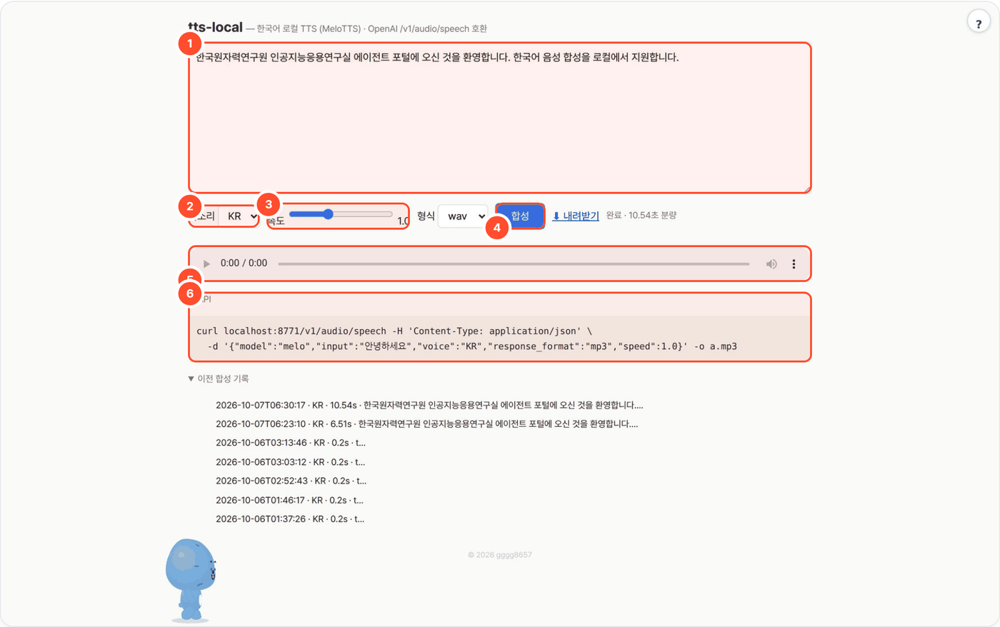

# tts-local — 한국어 로컬 TTS 서버 (MeloTTS) · OpenAI `/v1/audio/speech` 호환

> 글을 문장 단위로 나눠 [MeloTTS](https://github.com/myshell-ai/MeloTTS)로 합성합니다. 웹에서 듣거나 WAV·MP3로 받고, OpenAI 음성 API와 같은 `/v1/audio/speech`로 호출할 수 있습니다.



## 무엇을 하나

- 오픈소스 한국어 TTS MeloTTS(MIT, 한국어 모델 198MB)를 폐쇄망에서 바로 쓰는 음성 서버로 묶었습니다.
- 웹 UI에 글을 붙여넣으면 문장 단위로 합성해 wav/mp3를 내려 주고, OpenAI 음성 API와 같은 주소·형식을 제공해서 다른 도구(회의록 낭독, 팟캐스트 생성, 사내 방송 문구)가 코드 수정 없이 붙습니다.
- 클라우드·API 키 없음. 한국어 외 언어는 지원하지 않습니다(영어 섞인 문장은 읽음).
- **설치**: `bash setup.sh` 하나 (Python 3.11 venv → MeloTTS → 모델 다운로드 → 자가검증 → 서버). 폐쇄망은 `pack.sh` 번들.
- **외부 통신**: 모델 최초 다운로드만. 반입 후 `HF_HUB_OFFLINE=1`.
- **품질**: 또박또박 읽는 뉴스 톤 1종(`KR`). 감정·화자 복제는 없음 → 필요하면 CosyVoice2(Apache, 한국어, GPU) 또는 F5-TTS(MIT, 복제)로 교체.

## 사용 방법

화면의 번호: **①** 텍스트 입력 · **②** 목소리(한국어 `KR`) · **③** 속도(0.5~2.0) · **④** 합성 · **⑤** 재생·저장 · **⑥** API 호출 예시

1. **문장을 입력한다 (①)** — 읽을 글을 붙여넣습니다.
2. **속도와 형식을 고른다 (② ③)** — `KR` 목소리와 재생 속도, WAV 또는 MP3를 선택합니다. MP3 변환에는 ffmpeg가 필요합니다.
3. **합성 후 듣는다 (④ ⑤)** — 발음과 문장 사이 간격을 확인하고 파일을 받습니다. 다른 프로그램에서는 ⑥의 `/v1/audio/speech` 형식으로 부릅니다.

## 예시

실제 실행 결과입니다(2026-10-07).

입력:

```text
한국원자력연구원 인공지능응용연구실 에이전트 포털에 오신 것을 환영합니다. 한국어 음성 합성을 로컬에서 지원합니다.
voice: KR · speed: 1.0 · format: wav
```

출력:

```text
WORKSPACE/2026-10-07-83d8/audio.wav   10.54초 · 44,100Hz · 모노 · 16-bit PCM
WORKSPACE/2026-10-07-83d8/meta.json
```

## 설치·실행

```bash
bash setup.sh                       # http://localhost:8771
bash setup.sh stop
.venv/bin/python app.py --cli "2026년 10월 4일 회의를 시작하겠습니다." -o out.mp3 --speed 1.1
```

[agent-page-portal](https://github.com/gggg8657/agent-page-portal)에서 띄우면 포털이 포트(8771)·`WORKSPACE`·`TTS_DEVICE=cuda`를 넣어 줍니다. LLM은 쓰지 않습니다.

| 환경변수 | 기본 | 설명 |
|---|---|---|
| `PORT` | `8771` | |
| `WORKSPACE` | `./_workspace` | 웹 UI 합성 결과(`<run>/audio.wav·mp3`, `meta.json`) |
| `TTS_DEVICE` | `auto`(=cpu) | `cuda` 로 GPU — 번호는 고정하지 않고 모델을 올릴 때 여유 메모리가 가장 큰 GPU 를 고름(`gpu_pick.py`) |
| `GPU_POOL` / `GPU_IDLE_UNLOAD_S` | (전부) / `600` | GPU 후보 제한 / 이 초 동안 안 쓰면 모델을 내려 VRAM 반환(다음 요청 때 다시 고름, 0 이면 안 내림) |
| `TTS_DEFAULT_VOICE` | `KR` | MeloTTS 한국어는 화자 1개 |
| `TTS_ENGINE` | `melo` | 현재 melo만 구현 |
| `HF_HOME` / `HF_HUB_OFFLINE` | | 모델 캐시 위치 / 폐쇄망 1 |

## API (OpenAI 호환)

```bash
curl localhost:8771/v1/audio/speech -H 'Content-Type: application/json' \
  -d '{"model":"melo","input":"안녕하세요. 오늘 안건은 세 가지입니다.","voice":"KR","response_format":"mp3","speed":1.0}' -o a.mp3
curl localhost:8771/v1/audio/voices      # {"voices":["KR"],...}
curl localhost:8771/v1/models
```

웹 UI용: `POST /api/tts`(합성 + 저장, 메타 JSON) · `GET /api/runs`(이전 합성 기록) · `GET /audio/<run>.wav|mp3` · `GET /api/voices`.

OpenAI SDK도 그대로: `OpenAI(base_url="http://<서버>:8771/v1", api_key="x").audio.speech.create(model="melo", voice="KR", input="...")`.
긴 글은 `. ! ? …` 와 줄바꿈 기준으로 문장을 나눠 순서대로 합성한 뒤 이어 붙입니다(`3.5%` 같은 숫자 속 점은 안 자름). mp3 는 ffmpeg 가 있을 때만.

## 폐쇄망 반입

```bash
./pack.sh        # linux-x64 · Python 3.11 wheels + 모델(HF 캐시) → dist-offline/tts-local-linux-x64.tar.gz
```
내부망: 풀고 `bash setup.sh` (wheels/·models/ 가 있으면 다운로드 없이 설치, `HF_HUB_OFFLINE=1` 자동). 이 맥에서는 pack.sh 를 아직 실행해 보지 않았음(PoC).

## 구현 메모
- 서버는 stdlib `http.server`, 합성은 venv 안 MeloTTS 인프로세스. 전역 락 1개(동시 사용자 몇 명 수준).
- macOS 전용 우회: 대소문자 무시 파일시스템에서 MeloTTS 의존성 `mecab-python3`(일본어용)와 `python-mecab-ko`(한국어)가 같은 폴더로 합쳐져 깨짐 → setup.sh 가 한국어 것만 남기고, `MeCab.py` 스텁이 일본어 모듈 자리를 채움. Linux 서버에서는 해당 없음.
- 일본어용 사전 `unidic`(500MB) 다운로드 대신 `unidic_lite` 를 링크(한국어엔 안 쓰임).
- `selftest.py` 는 가짜 엔진으로 분리·연결·mp3·API 파싱만 검사(모델 불필요).

## 출처·감사 (Credits)

- [MeloTTS](https://github.com/myshell-ai/MeloTTS) (MIT, MyShell.ai) + 한국어 체크포인트 [myshell-ai/MeloTTS-Korean](https://huggingface.co/myshell-ai/MeloTTS-Korean) (MIT)
- 한국어 BERT [kykim/bert-kor-base](https://huggingface.co/kykim/bert-kor-base) (라이선스는 원 저장소 참고)
- [g2pkk](https://github.com/harmlessman/g2pkk) (Apache-2.0), python-mecab-ko + mecab-ko-dic (Apache-2.0 / BSD 계열)
- 이 도구는 [agent-page-portal](https://github.com/gggg8657/agent-page-portal) 에 연결해 쓰도록 만들었습니다(단독 실행도 됨).

저작권 표기·전체 목록은 `NOTICE` 를 보세요.

## 라이선스

MIT License — Copyright (c) 2026 gggg8657. `LICENSE` 참고.
